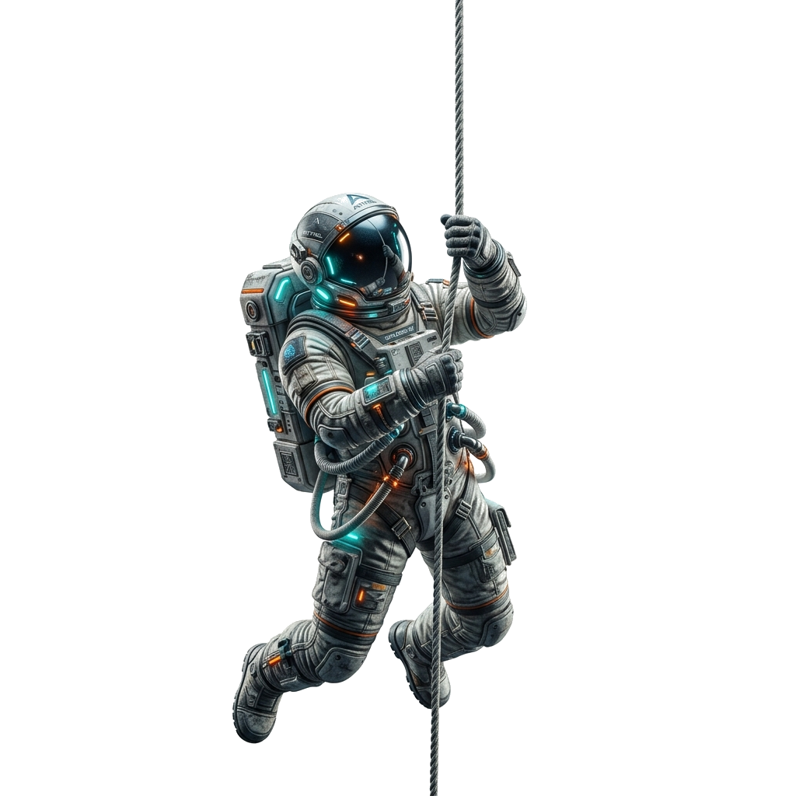
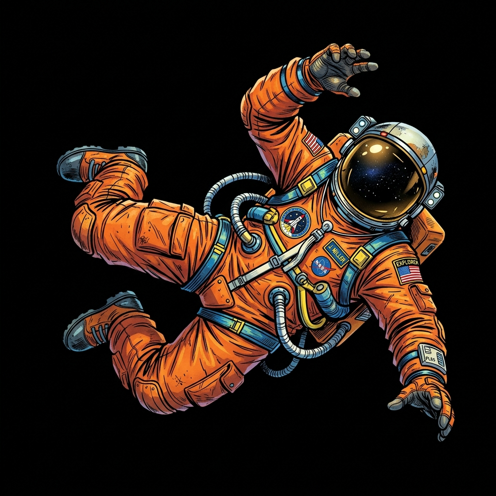

# 🚀 Agam Kundu | Premium 3D Developer Portfolio

A high-performance, ultra-modern portfolio website built with React, Vite, Framer Motion, and Three.js. This portfolio showcases a deep focus on interactive 3D elements, buttery-smooth scroll animations, and premium minimalist aesthetics.



## ✨ Key Features

- **Interactive 3D Environments:** Integrated `react-three-fiber` and `three.js` to render high-quality GLTF/GLB models (like the floating spaceman and interactive project vehicles) directly in the browser.
- **Cinematic Animations:** Powered by `framer-motion`, featuring Apple-style stacked scroll animations, staggered text reveals, and fluid page transitions.
- **Minimalist "Liquid Glass" UI:** Custom dark-mode styling utilizing glassmorphism, glowing micro-interactions, and premium typographic choices.
- **Performance Optimized:** Built with Vite for lightning-fast HMR and optimized production bundling.
- **Seamless SPA Routing:** Global `react-router-dom` configuration with auto-scroll-to-top routing logic and configured Vercel rewrites for robust production deployment.

## 🛠️ Tech Stack

- **Frontend Framework:** React 18
- **Build Tool:** Vite
- **Styling:** Tailwind CSS + Vanilla CSS
- **Animations:** Framer Motion
- **3D Rendering:** Three.js, React Three Fiber, React Three Drei
- **Routing:** React Router DOM
- **Deployment:** Vercel

## 📸 Project Screenshots

> **Tip:** You can replace these images with actual full-page screenshots of your website! Just add the screenshots to your `/public` folder and update the links below.

### 🏠 Immersive Hero Section

*Featuring smooth typing animations, glowing highlights, and a floating 3D spaceman background.*

### 📚 Stacked Project Cards

*A high-end, scroll-controlled stacked deck animation that reveals sections sequentially as the user scrolls.*

## 💻 Running Locally

To run this project on your local machine:

1. **Clone the repository:**
   ```bash
   git clone https://github.com/agam263/Portfolio-website.git
   cd Portfolio-website
   ```

2. **Install dependencies:**
   ```bash
   npm install
   ```

3. **Start the development server:**
   ```bash
   npm run dev
   ```

## 🌐 Deployment

This project is optimized for deployment on Vercel. A `vercel.json` file is included in the root directory to handle SPA client-side routing rewrites, preventing 404 errors on page refresh.

## 👨‍💻 About the Developer

Built by **Agam Kundu** – Undergraduate CS student specializing in AI/ML. Passionate about system design, user experience, and creating impactful digital products. Based in Bangalore, India.
